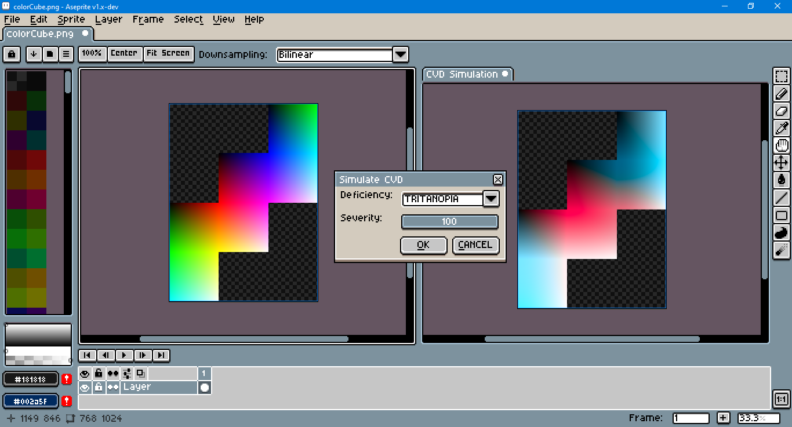
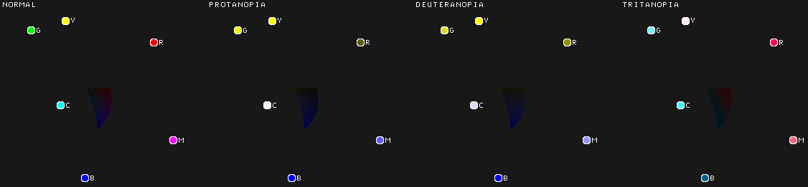

# Aseprite CVD Simulation
## With libDaltonLens

This repository is an adaptation of [libDaltonLens](https://github.com/DaltonLens/libDaltonLens) by [Nicolas Burrus](https://github.com/nburrus) to Lua. The code is simulates how individuals with color vision deficiency (CVD), also known as color blindness, would view an image. As with the original repository, this code uses the [Unlicense](https://unlicense.org/), and is released to the public domain.

The code has been modified for use with the [Aseprite](https://www.aseprite.org/) [scripting API](https://github.com/aseprite/api).

To use this script, open Aseprite, go to `File > Scripts > Open Scripts` Folder. Copy and paste the Lua script from this repository into that folder. Return to Aseprite; go to `File > Scripts > Rescan Scripts` Folder (the default hotkey is `F5`). The script should now be listed under `File > Scripts`. Select `aseDaltonLens.lua` to launch the dialog.

To assign a hotkey to the dialog script go to `Edit > Keyboard Shortcuts`. Once the dialog is open, `Alt+O` is the keyboard shortcut for the OK button. `Alt+C` is the shortcut for the CANCEL button.

Upon activation, the script will duplicate the active sprite, convert it to RGB color mode, flatten its layers and then create a new layer with the CVD simulation of the source images.

This is an animated plot for the three types of CVD, protanopia, deuteranopia and tritanopia:

The plot was made [SRLAB2](https://www.magnetkern.de/srlab2.html), a variant of CIE LAB. The plotted points are the sRGB primary and secondary colors: red (R), yellow (Y), green (G), cyan (C), blue (B) and magenta (M). Note that these 6 colors are not located at the same angle -- nor are they the same angular distance from one another -- as they would be if they were plotted on an HSV/HSL color wheel.

For more information, Burrus's articles are recommended:
- [Review of Open Source Color Blindness Simulations](https://daltonlens.org/opensource-cvd-simulation/)
- [Understanding LMS-based Color Blindness Simulations](https://daltonlens.org/understanding-cvd-simulation)
- [Evaluating Color Blindness Simulations](https://daltonlens.org/evaluating-cvd-simulation/)